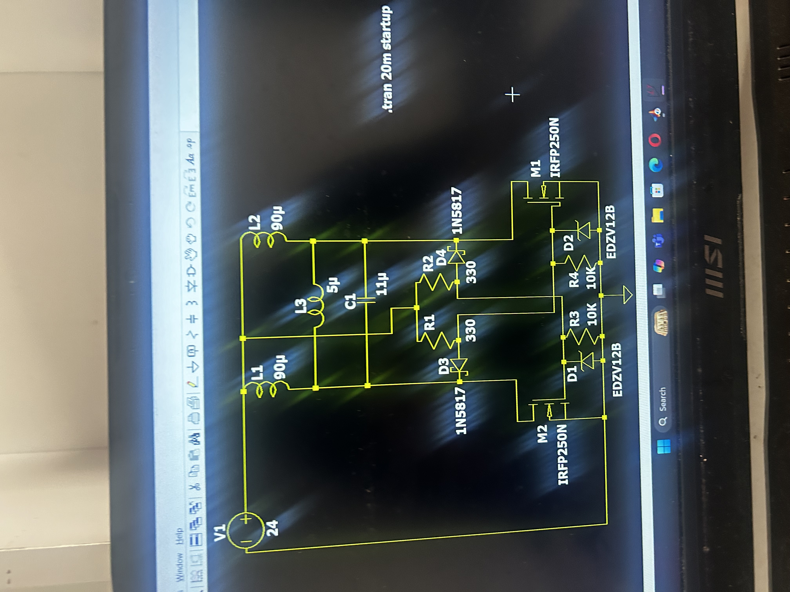

# zvs-induction-heater-1.4kw
This project involves the design and development of a high-power induction heating system based on a Zero Voltage Switching (ZVS) topology.

The system operates using a resonant LC tank driven by MOSFET-based oscillation, enabling efficient high-frequency current generation for induction heating applications.

---

## ⚙️ System Specifications
- Power Rating: ~1.4 kW  
- Input Supply: 24V DC (800W SMPS)  
- Operating Frequency: ~50 kHz  
- Output Voltage (Resonant Tank): ~400V peak  
- Topology: ZVS (Zero Voltage Switching)  

---

## 🔌 Hardware Components
- MOSFETs: IRFP4668 (x2)  
- High-voltage capacitors (400V rated)  
- Induction heating coil (custom wound)  
- Choke inductors for current stabilization  
- Zener diodes (12V gate protection)  
- High-current diodes for reverse current blocking  
- Heat sinks and cooling system  

---

## 🧠 Working Principle

The system operates based on an LC resonant tank:

- The MOSFETs form a self-oscillating circuit  
- The LC tank determines the resonant frequency  
- At resonance, high-frequency alternating current flows through the coil  
- This produces a rapidly changing magnetic field  
- Conductive materials placed inside the coil heat up due to induced currents  

📌 The oscillation occurs near the natural frequency:

f = 1 / (2π√LC)

---

## 🔁 ZVS Operation

- MOSFETs switch at near-zero voltage conditions  
- This reduces switching losses and heat generation  
- Enables efficient high-frequency operation  
- Maintains sustained oscillations in the LC tank  

---

## ⚡ Design Highlights

- Used choke inductors (L2, L3) to stabilize current flow and reduce surges  
- Designed for high current handling (~50–60A range)  
- Implemented gate protection using Zener diodes  
- Used high-current copper wiring (low resistance)  
- Designed cooling system to handle thermal stress  

---

## 📐 Design Calculations

- Resonant frequency targeted around 50 kHz  
- LC tank values selected based on:

  - Inductance ≈ 10 µH  
  - Capacitance ≈ 6.33 µF  

- Peak voltage in tank estimated around 288V (≈144V RMS)  
- High current (~80A RMS) observed in resonant loop  

(Refer to project notes for full derivations)

---

## ⚠️ Engineering Challenges

- Handling high current (~50A+) without overheating  
- Managing voltage spikes due to inductive switching  
- Selecting appropriate capacitor ratings (high voltage + high frequency)  
- Maintaining stable oscillation without damaging MOSFETs  
- Designing safe power supply and rectification stages  

---

## System and functioning

 

[Watch Video](https://drive.google.com/file/d/1wP6uLdd17gAQOnQQtV3wy-7aRtJyPkXM/edit)

---

## 🔧 Improvements & Future Work
- Improve PCB-based layout to reduce parasitic effects  
- Add proper EMI shielding and filtering  
- Implement current sensing and protection circuits  
- Optimize coil design for higher efficiency  
- Upgrade cooling system for continuous operation  

---

## 🏁 Conclusion
This project demonstrates practical implementation of high-power resonant systems and highlights key challenges in power electronics, including switching losses, thermal management, and high-current circuit design.
